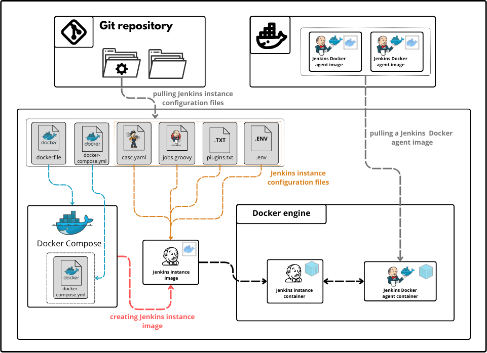

# JCasC
JCasC stands for Jenkins Configuration as Code, in this project we will use JCasC plugin to make a preconfigured Jenkins instance running as a Docker container.


JCasC plugin logo

## Description
If you’ve looked at the Jenkins configuration settings, you may have noticed that they can be somewhat cluttered. What’s more, since the configuration varies according to the plugins installed and their versions, your configuration may vary from one Jenkins server to another. The process of modifying a huge configuration page can then become frightening. What’s more, it makes no sense to have manual Jenkins configurations and coded Jenkins pipelines, with all the attendant problems - data loss, difficulty replicating configurations, lack of versioning and inability to track changes, to name but a few. There should be a simpler, more DevOps-oriented method, and that’s the subject of this sub-section, which is the creation of a fully pre-configured Jenkins instance using a Jenkins plugin called JCasC (Jenkins Configuration as Code). In fact, this Jenkins plugin has reduced manual intervention to zero thanks to a set of configuration files and scripted actions.

## Project components and files
**Dockerfile:** this Dockerfile describes the custom Jenkins image we'll be working on.

**plugins.txt:** In this file, you'll list the plugins you want. These plugins will be installed as soon as the custom Jenkins image is created.

**casc.yaml:** this file contains the Jenkins configuration as code used by the JCasC plugin to perform the desired initial configurations.

**pipeline.groovy:** this file contains your Jenkins pipelines for provisioning.

**docker-compose.yml:** this docker compose file is used to launch the jenkins container instance with the correct parameters (such as volumes and environment variables).

**.env:** this file contains the environment variables used by the jcasc plugin.

## Visuals
**Architecture:**



## Usage
**Step 1:**

- clone the repository on your local machine.

**Step 2:**

- change the variables in the .env file.
- modify the plugins in plugins.txt to install the plugins you want, but *do not delete the configuration-as-code plugin* as it is used to perform configurations.
- modify the pipeline.groovy by adding your pipelines.

**Step 3:**

- create the custom image.
  inside the root directory of this project run:
```shell
$ docker build -t jenkins:jcasc .
```

**Step 4:**

- run the created Jenkins image. 
```shell
$ docker-compose up -d 
```

## Support

- for help contact me on my email address : tbn.khalil@gmail.com 

## Project status

**active**
